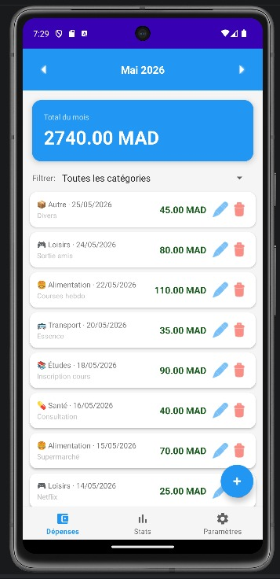
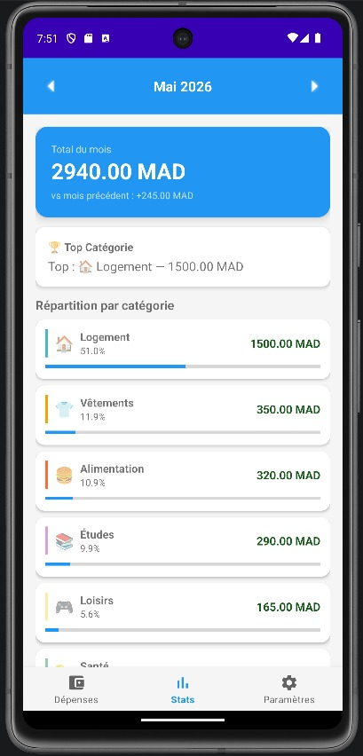
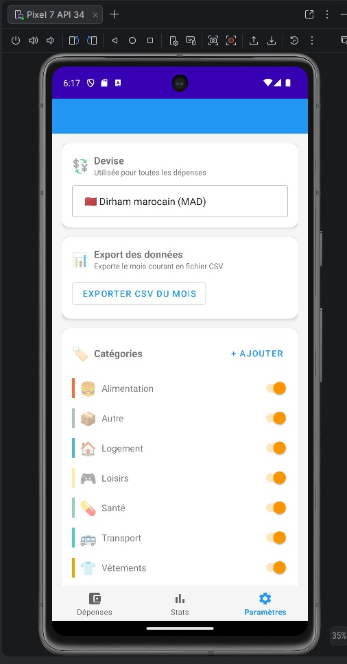
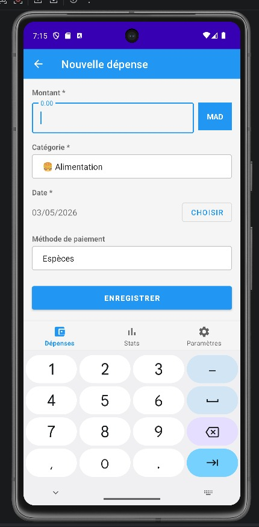
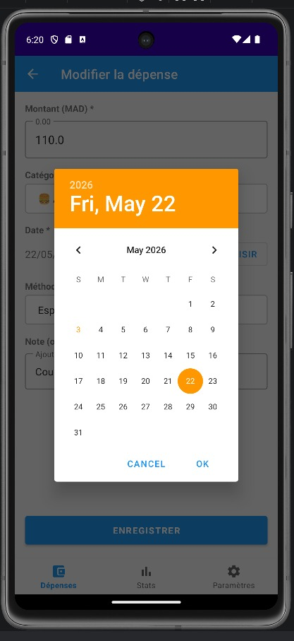
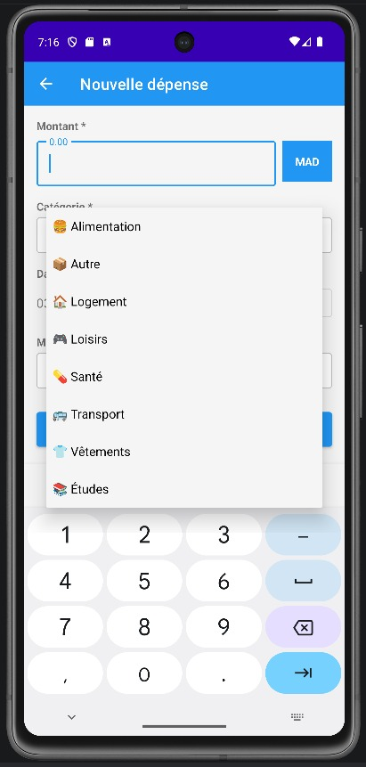
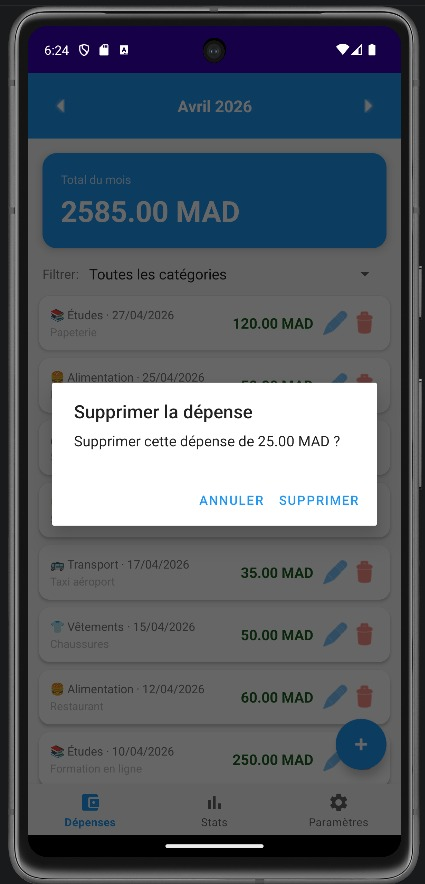
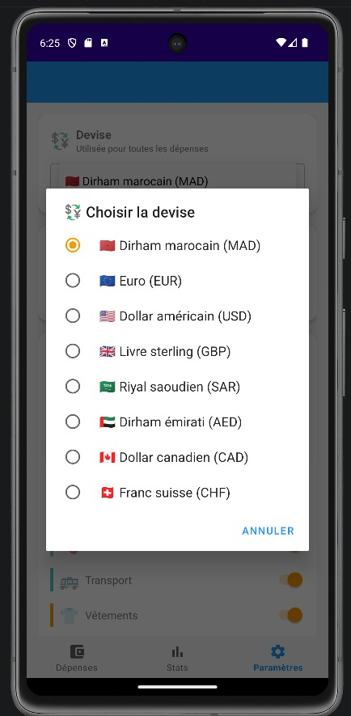
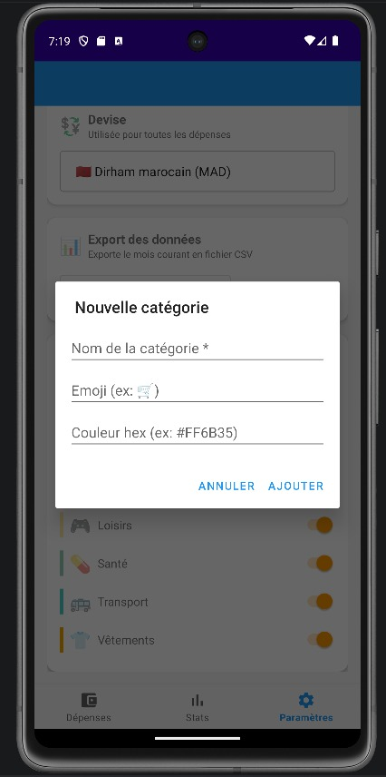
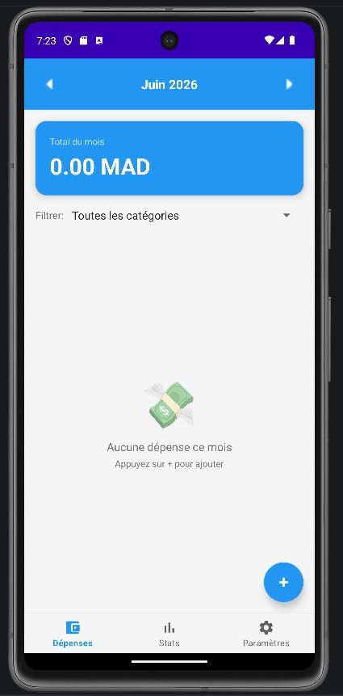

# 💰 SmartBudget

> Application Android native de gestion de budget personnel — Offline-first, développée en Kotlin


---

## 📱 Aperçu

SmartBudget est une application Android permettant de **suivre ses dépenses personnelles**, de les catégoriser, de consulter des statistiques mensuelles et d'exporter ses données — le tout **sans connexion Internet**.

Développée dans le cadre du module **Développement Mobile** — Filière LSI, Semestre S4, Année universitaire 2025-2026.

| Écran | Description |
|---|---|
| 💳 Dépenses | Liste mensuelle, total, filtre par catégorie |
| 📊 Statistiques | Répartition, top catégorie, comparaison N vs N-1 |
| ⚙️ Paramètres | Devise, catégories, export CSV |

---

## 📸 Captures d'écran

<p align="center">
  
  
  
  
  
  
  
  
  
  
  
  


---

### 💳 Écran Dépenses — Liste mensuelle

<p align="center">
  
</p>

> Liste de toutes les dépenses de Mai 2026 avec total **2 335,00 MAD**, filtre par catégorie et bouton **+** pour ajouter.

---

### ➕ Formulaire — Ajouter / Modifier

<p align="center">
  
</p>

> Formulaire avec champ montant + **badge devise dynamique** (MAD par défaut), sélecteur de catégorie, DatePicker et note libre.

---

### 📊 Écran Statistiques

<p align="center">
  
</p>

> Répartition par catégorie avec barres de progression, top catégorie et comparaison avec le mois précédent.

---

### ⚙️ Écran Paramètres

<p align="center">
  
</p>

> Sélection de la devise (8 devises disponibles), export CSV du mois et gestion des catégories (ON/OFF).

---

## ✨ Fonctionnalités

### Principales
- ✅ **CRUD complet** — Ajouter, modifier, supprimer des dépenses
- ✅ **Catégorisation** — 8 catégories par défaut (Alimentation, Transport, Logement…)
- ✅ **Navigation mensuelle** — Boutons ◀ ▶ pour naviguer entre les mois
- ✅ **Filtrage** — Par catégorie depuis un spinner
- ✅ **Total du mois** — Calculé automatiquement en temps réel
- ✅ **Statistiques** — Répartition par catégorie avec barres de progression
- ✅ **Comparaison** — Mois courant vs mois précédent
- ✅ **Offline-first** — 100% fonctionnel sans Internet

### Bonus
- 📤 **Export CSV** — Export du mois courant en fichier `.csv`
- 💱 **Gestion devise** — 8 devises (MAD, EUR, USD, GBP, SAR, AED, CAD, CHF)
- 🗃️ **Données de démo** — 34 dépenses prépopulées sur 2 mois au premier lancement

---

## 🏗️ Architecture

L'application suit le patron **MVVM** recommandé par Google :

```
UI (Fragment)
    ↕  observe LiveData
ViewModel
    ↕  appelle
Repository
    ↕  requête
Room Database (SQLite local)
```

### Stack technique

| Composant | Technologie | Version |
|---|---|---|
| Langage | Kotlin | 1.9.10 |
| Architecture | MVVM | — |
| Base de données | Room (SQLite) | 2.6.1 |
| Injection de dépendances | Hilt | 2.48 |
| Navigation | Navigation Component + SafeArgs | 2.7.5 |
| Observable | LiveData + ViewModel | 2.6.2 |
| Liaison des vues | ViewBinding | — |
| UI | Material Design 3 | 1.11.0 |
| Asynchrone | Kotlin Coroutines | 1.7.3 |
| Build | Gradle + KSP | 8.0 |

---

## 📂 Structure du projet

```
SmartBudget/
├── app/
│   └── src/main/
│       ├── java/com/smartbudget/
│       │   ├── data/
│       │   │   ├── local/
│       │   │   │   ├── dao/            ← CategoryDao, ExpenseDao, MonthlyBudgetDao
│       │   │   │   ├── entity/         ← Category, Expense, MonthlyBudget
│       │   │   │   └── AppDatabase.kt  ← Room DB + prépopulation démo
│       │   │   └── repository/         ← ExpenseRepository, CategoryRepository
│       │   ├── di/
│       │   │   └── DatabaseModule.kt   ← Module Hilt
│       │   ├── ui/
│       │   │   ├── expenses/           ← Fragment + ViewModel + Adapter
│       │   │   ├── add/                ← Fragment + ViewModel
│       │   │   ├── stats/              ← Fragment + ViewModel + Adapter
│       │   │   └── settings/           ← Fragment + ViewModel + Adapter
│       │   └── utils/
│       │       ├── DateUtils.kt
│       │       ├── CsvUtils.kt
│       │       └── CurrencyPreferences.kt
│       └── res/
│           ├── layout/                 ← XMLs des écrans
│           ├── navigation/             ← nav_graph.xml
│           ├── menu/                   ← bottom_nav_menu.xml
│           ├── drawable/               ← icônes vectorielles
│           └── values/                 ← colors, strings, themes
├── build.gradle
└── settings.gradle
```

---

## 🚀 Installation et exécution

### Prérequis

| Outil | Version minimale |
|---|---|
| Android Studio | Hedgehog (2023.1) ou plus récent |
| JDK | 17 |
| Android SDK | API 34 (Android 14) |
| Gradle | 8.0 (téléchargé automatiquement) |

### Étapes

```bash
# 1. Cloner le dépôt
git clone https://github.com/NohaylaLafdil/SmartBudget.git

# 2. Ouvrir dans Android Studio
#    File → Open → sélectionner le dossier SmartBudget/

# 3. Synchroniser Gradle
#    Cliquer "Sync Now" dans la barre de notification

# 4. Lancer sur l'émulateur
#    Shift + F10  (ou bouton ▶ vert)
```

> ⚠️ Au premier lancement, l'app insère automatiquement **34 dépenses de démo** réparties sur 2 mois. Pour réinitialiser : désinstaller l'app puis la réinstaller.

---

## 🗃️ Modèle de données

### Expense
```kotlin
@Entity(tableName = "expenses")
data class Expense(
    val id: Long = 0,
    val amount: Double,
    val currency: String = "MAD",
    val date: Long,
    val categoryId: Long,
    val note: String = "",
    val paymentMethod: String = "Espèces",
    val createdAt: Long,
    val updatedAt: Long
)
```

### Category
```kotlin
@Entity(tableName = "categories")
data class Category(
    val id: Long = 0,
    val name: String,
    val icon: String,
    val color: String,
    val isActive: Boolean = true
)
```

---

## 🏷️ Catégories par défaut

| Icône | Catégorie | Couleur |
|---|---|---|
| 🍔 | Alimentation | `#FF6B35` |
| 🚌 | Transport | `#4ECDC4` |
| 🏠 | Logement | `#45B7D1` |
| 💊 | Santé | `#96CEB4` |
| 🎮 | Loisirs | `#FFEAA7` |
| 📚 | Études | `#DDA0DD` |
| 👕 | Vêtements | `#F0A500` |
| 📦 | Autre | `#B0BEC5` |

---

## 💱 Devises supportées

`🇲🇦 MAD` · `🇪🇺 EUR` · `🇺🇸 USD` · `🇬🇧 GBP` · `🇸🇦 SAR` · `🇦🇪 AED` · `🇨🇦 CAD` · `🇨🇭 CHF`

La devise par défaut est le **Dirham marocain (MAD)**. Elle se configure dans `Paramètres → Devise`.

---

## 📤 Format d'export CSV

```csv
Date,Montant,Devise,Categorie,Note,Methode Paiement
01/05/2026,1500.00,MAD,Logement,"Loyer",Especes
02/05/2026,85.00,MAD,Alimentation,"Courses Marjane",Especes
03/05/2026,45.00,MAD,Transport,"Bus mensuel",Carte bancaire
```

Le fichier est enregistré dans le stockage interne de l'app (`getExternalFilesDir`).


